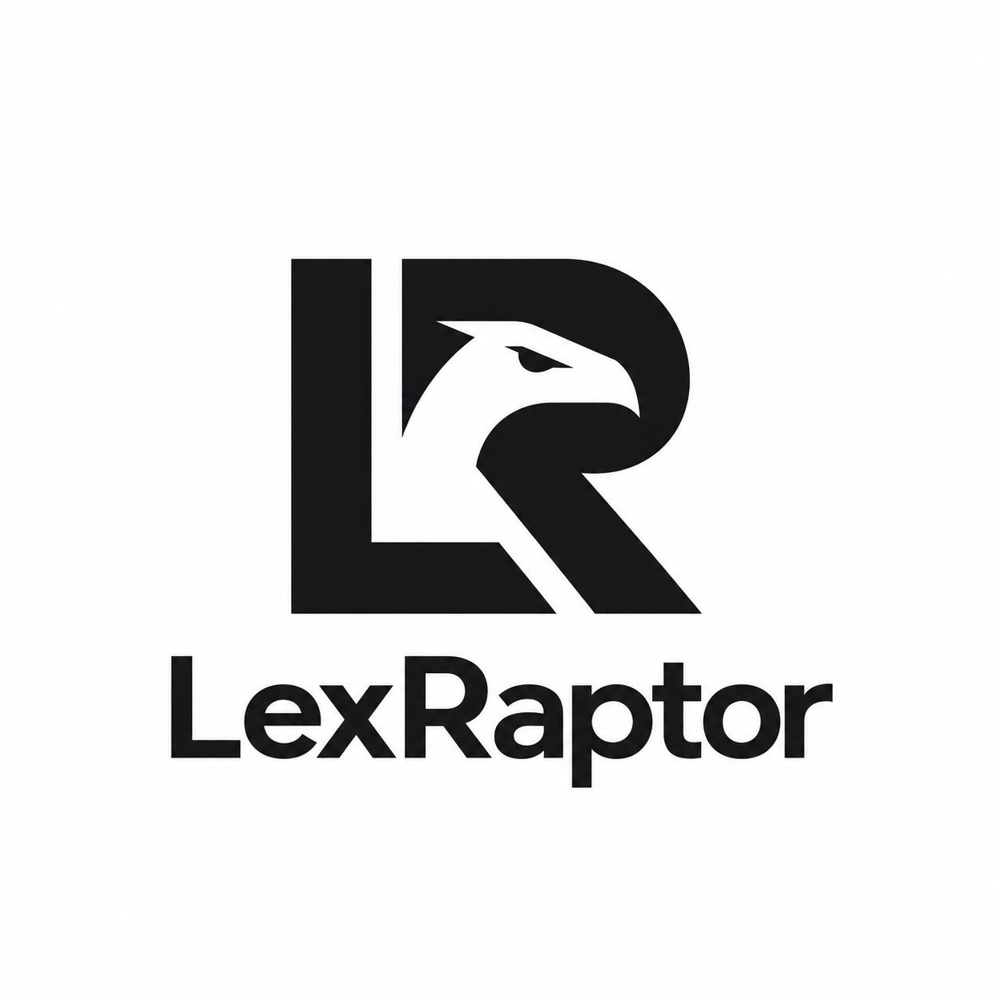

# Lex Raptor



**Open-source legal research. Your sources, your model, your control.**

Lex Raptor searches a local case-law library, drafts answers with inspectable source quotations, and keeps private matter documents in a separate workspace. Run inference locally for **$0 software, connection, or model API fees**; you supply the hardware and electricity. Optional OpenAI/Anthropic API inference retains explicit administrator controls and hard spending limits. No automatic cloud fallback.

The project is **AGPL-3.0-only**. The code, local inference, search, source reader, document workflows, and API adapters are all included. Optional managed API connections are the planned paid service; payment collection is not implemented. See [the business model](docs/BUSINESS_MODEL.md) and [governance](GOVERNANCE.md).

**[lexraptor.com](https://lexraptor.com)** opens directly to research chat. Its source is in [website/](website/). Automatic mode selects tasks, search terms and databases; users can override each choice. Project information is on separate About, Sources and Run locally pages. The source repository is [zacheidex/lex-raptor](https://github.com/zacheidex/lex-raptor).

## Local matter workspace

After starting the app, open **http://localhost:3000**. The local workspace opens directly: **no account, email, password, or API connection required**. Choose your databases, enter a legal question, then choose **Search opinions** or **Ask Lex Raptor**. Select any citation to inspect its quotation, extracted passage, opinion type, and original Harvard CAP record. Research history survives reloads. The application uses the owner's supplied raptor monogram logo.

The starter library contains **12 U.S. Supreme Court opinions, 1938–2014**, selected for civil procedure, evidence, and equal protection. This is a small demonstrator, not comprehensive jurisdiction coverage. Court/date filters restrict retrieval. No Westlaw, Casetext, KeyCite, editorial headnotes, or proprietary citator data is used.

**Database selection:** Harvard CAP is available after importing the starter library. CourtListener is visibly marked **Not connected** and cannot be selected. The selection applies to both keyword search and AI evidence retrieval; selecting nothing blocks submission instead of silently searching everything. Database preferences stay in the browser, while each saved answer records the databases actually searched. Each passage retains database provenance. Private matter documents remain separate from these public case-law databases.

**What works:** local full-text retrieval, bounded local AI answers, exact quotation checking, opinion reader, saved research, source provenance and hashes, separate majority/dissent labels, source export, private matters, original-document uploads and ingestion, source-supported document drafting, attorney review and DOCX export, tenant isolation, durable jobs, cancellation, and optional metered API adapters. Local inference is the default.

**What remains:** corpus expansion/updates, additional database connectors, a validated subsequent-treatment citator, broader legal-quality evaluation, semantic retrieval, managed billing, and hosted research. The owner has authorized a public repository and project website. The source download contains the corresponding application source; it excludes credentials, private matters, private build notes, model weights, and downloaded case data.

## Start locally

Requirements: Python 3.11+, Node 20.9+, Docker, uv, and Ollama. The default `qwen3:14b` model downloads about 9.3 GB. It is an Apache-2.0 model; its license is separate from the application's. This workstation has an RTX 4090 with 24 GB VRAM. Other machines may need a smaller locally installed model and a matching `OLLAMA_MODEL` setting.

```bash
uv sync --locked --group evaluator
npm ci --prefix apps/web
npx supabase start --exclude studio,imgproxy,realtime,edge-runtime,logflare,vector,supavisor,postgres-meta,inbucket
```

Local Supabase supplies Postgres and private file storage in free Docker services. A managed cloud account is not required. Run `.venv/bin/python scripts/configure_local.py` to write a private `.env.local` from the running local Supabase project without printing credentials. Existing settings are preserved. `npx supabase status` displays local keys; do not copy its output into issues or public logs. Initialize the local workspace with `.venv/bin/python scripts/local_setup.py`. With `LEX_RAPTOR_AUTH=local`, that script creates internal ownership records without a Supabase Auth account or password, and disables paid generation. It only accepts the loopback Supabase development endpoint.

To upgrade an earlier account-based local installation, set `LEX_RAPTOR_AUTH=local` in `.env.local`, run `scripts/local_setup.py`, and restart the app. The setup helper reuses the owner ID from the existing private `data/local-admin.json` so matters and research remain available; it does not need the password or remove old records. If that file is unavailable, use `--existing-user-id OWNER_UUID` to choose the existing workspace explicitly. The local workspace is shared by people using this computer. App services bind to loopback; account-free access rejects remote hosts and API inference. Account controls and invitations are disabled in this mode.

Start Ollama with cloud features disabled, then pull the model once:

```bash
OLLAMA_NO_CLOUD=1 OLLAMA_HOST=127.0.0.1:11434 OLLAMA_FLASH_ATTENTION=1 OLLAMA_KV_CACHE_TYPE=q8_0 OLLAMA_NUM_PARALLEL=1 ollama serve
# In another terminal:
ollama pull qwen3:14b
```

On this workstation, `.venv/bin/python scripts/start_ollama.py` starts the verified user-local installation. Set `LEX_RAPTOR_OLLAMA_BINARY` on other machines, or put `ollama` on PATH. The application accepts a loopback HTTP endpoint and rejects remote/cloud model records. The service does not download models in response to a user query. Inference makes no legal-data web requests; only explicit import commands fetch public opinions. Clicking an original-source link opens that third-party site.

```bash
.venv/bin/python scripts/import_cases.py --fetch-starter
.venv/bin/python scripts/package_source.py
npm run build --prefix apps/web
.venv/bin/python scripts/start_local.py
```

Stop app services with `.venv/bin/python scripts/stop_local.py`. Stop local Supabase with `npx supabase stop`, retaining its data. Ollama runs separately; its local PID is in `data/ollama.pid` when launched by the helper. Never use destructive database resets on a working installation.

## Data and evidence

Starter sources are downloaded from Harvard's [Caselaw Access Project](https://case.law/). [CAP's access restrictions expired in 2024](https://lil.law.harvard.edu/blog/2024/03/26/transitions-for-the-caselaw-access-project/). The importer stores opinion text, excludes publisher headnotes, preserves original JSON under `data/caselaw/`, and pins raw-file SHA-256 hashes in `benchmark/research/corpus.lock.json`. Additional public CAP opinion files can be imported with `scripts/import_cases.py --file FILE --source-url ORIGINAL_STATIC_CAP_JSON_URL`. This owner-operated importer is not a browser upload endpoint for private records.

The importer follows CAP's opinion labels, with explicit heading detection for merged dissents/concurrences. These extraction heuristics are not a certified opinion-segmentation system. Locators identify **CAP extracted paragraphs and character offsets**, not invented reporter pinpoint citations. Source records may contain OCR errors. Research generation selects a disclosed subset of retrieved passages; it does not read every opinion. Matter drafting, in contrast, fails on excessive input rather than silently dropping evidence.

An exact quoted passage is not proof that the model's proposition follows from it. **Current validity, subsequent treatment, legal completeness, and semantic entailment are not automatically certified.** Inspect the actual holding, context, opinion type and later authorities before relying on an answer. Legal-source content is treated as untrusted evidence; there are no model tools for web browsing, shell access, filing, sending messages, or training on private matter data.

## Tests and benchmark

See [the research evaluation](benchmark/research/RESULTS.md) for actual local-model outcomes and limitations. This is a development/regression diagnostic on a small public corpus, not a commercial legal-product comparison or a hidden holdout. Public landmark cases may already be in the model's training data. No LLM judge grade is represented as attorney validation.

The live Qwen3:14b run completed 15/15 tasks at a median 7.49 seconds and $0 API cost. All 11 answerable tasks retained an answer, but only 8/11 cited every expected case; 37/48 raw quotations matched exactly and 11 propositions were removed. All three insufficient-evidence/current-validity tasks abstained. **Retained answers still contain support errors**, including an omitted exception in Erie; read the [qualitative review](benchmark/research/QUALITATIVE_REVIEW.md) before interpreting these figures. Local research and synthetic-document drafting also passed an end-to-end smoke, with attorney approval left pending.

```bash
# Dedicated disposable test DB; omit if already running:
docker run -d --name defense-test-db -e POSTGRES_PASSWORD=local-test-only -e POSTGRES_DB=defense_test -p 127.0.0.1:55432:5432 postgres:17-alpine
.venv/bin/python -m pytest -q
.venv/bin/ruff check engine tests scripts
npm run build --prefix apps/web
node apps/web/browser-check.mjs
node apps/web/research-check.mjs
.venv/bin/python scripts/local_smoke.py
node apps/web/local-answer-check.mjs
.venv/bin/python scripts/research_benchmark.py
.venv/bin/python scripts/research_report.py
```

The earlier insurance-defense benchmark and its reports are preserved separately in [the legacy handoff](docs/LEGACY_DEFENSE_MVP.md) and `benchmark/RESULTS.md`. Its unpaid mechanics runs do not establish local-model research quality. The owner-authorized live API budget remains **at most $100 total** across the session. Local inference never debits this budget.

## Optional API mode

Set `LEX_RAPTOR_AUTH=account` and `LEX_RAPTOR_INFERENCE=api` only as an explicit administrator choice, with a provisioned Auth account before switching. Configure a dedicated provider API key in the worker environment, independently verified model prices, and the global/organization/user caps using the existing owner CLI in [docs/ADMIN.md](docs/ADMIN.md). Paid calls start disabled. Restart app services after configuration changes. Queued research requests fail if inference mode changes, requiring a new submission; they do not silently become paid requests. Account-free mode refuses API inference in both the API and worker.

The managed connection business model is described in [docs/BUSINESS_MODEL.md](docs/BUSINESS_MODEL.md). This checkout does **not** collect customer payments or add a service fee. In self-hosted API mode, the provider bills your own API account. Existing production container templates in `deploy/` are for API mode and managed Supabase; the documented local path above is the tested free deployment. Never expose the unauthenticated Ollama port publicly.

## License and independence

Copyright 2026 Lex Raptor contributors. Distributed under GNU AGPL version 3 only, without warranty. See [LICENSE](LICENSE), [NOTICE](NOTICE), [CONTRIBUTING.md](CONTRIBUTING.md), and [GOVERNANCE.md](GOVERNANCE.md). Third-party software, model weights and source data retain their own licenses.

AGPL does not prohibit acquisition or commercial hosting. It preserves compliant recipients' rights to released versions and requires qualifying modified network versions to offer their corresponding source. Community forks remain possible. There is no copyright assignment requirement for contributions and no promise that a company, trademark or future development can never change hands.

## Research chat

The [research chat](https://lexraptor.com) supports source search, case briefs, research memos, authority comparisons, arguments and responses, citation lookup, and text/JSON exports. It searches live eCFR and Federal Register data without a key, the bundled CAP starter library offline, and nationwide CourtListener case law when its owner token is configured. Source search uses no model credits. Hosted drafts use the existing server-side OpenAI key and durable **$10 total API cap**; no account or passcode is required. App request-count limits are removed for testing; provider quotas still apply.

The same workbench can draft with local Ollama, without an OpenAI key or model fee:

```sh
npm --prefix website ci
npm --prefix website run local
```

With Ollama running and `qwen3:14b` installed, open http://127.0.0.1:8787/demo. The original Python/Next.js workspace and private Matters features remain separate. See [workbench setup and limits](website/README.md) and [free data access and student resources](docs/DATA_AND_STUDENT_ACCESS.md). Online data selections send search terms to the selected provider even when the model runs locally.

[Hosted demo smoke checks and cost record](benchmark/hosted-demo/RESULTS.md) describe the limited live validation separately from the local-model diagnostic.

[Workbench development diagnostic](benchmark/workbench/RESULTS.md) covers the expanded workflows and live data adapters, including failed early runs and remaining quality gaps.
